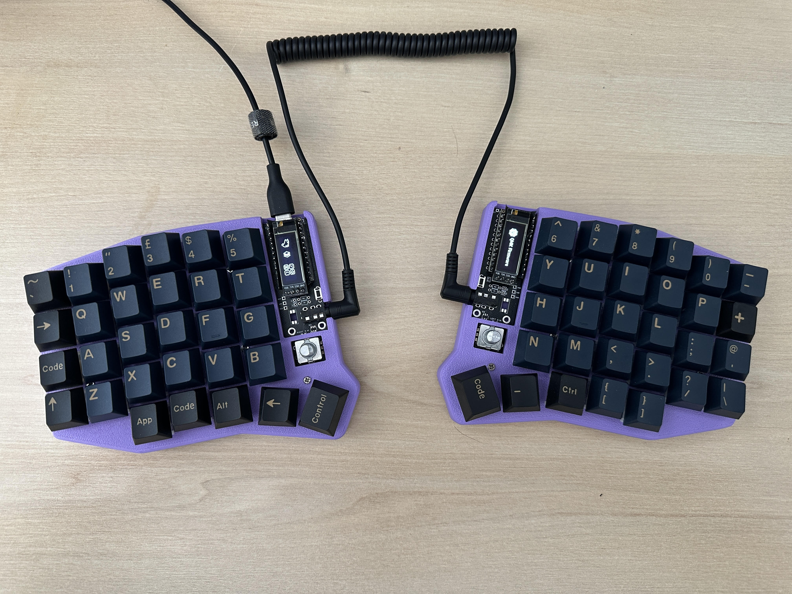

# dev

**My personal Linux environment.**

Dotfiles and config for my Arch Linux setup - Hyprland (PC) and i3 (Laptop & work dev machine).

Includes configs for Neovim, tmux, Waybar, Polybar, Ghostty, Rofi and more.

## Deploying

Uses a Bash script with rsync to deploy configs to the right places:

```bash
DEV_ENV=env ./update-config
```

Run from the repo root. Set `DEV_ENV` to point at the env directory.

## Keyboard

For those curious about `kb_layout/` - I daily drive a Sofle RGB I soldered myself, running Vial:


*Still yet to buy encoder knobs :P*
